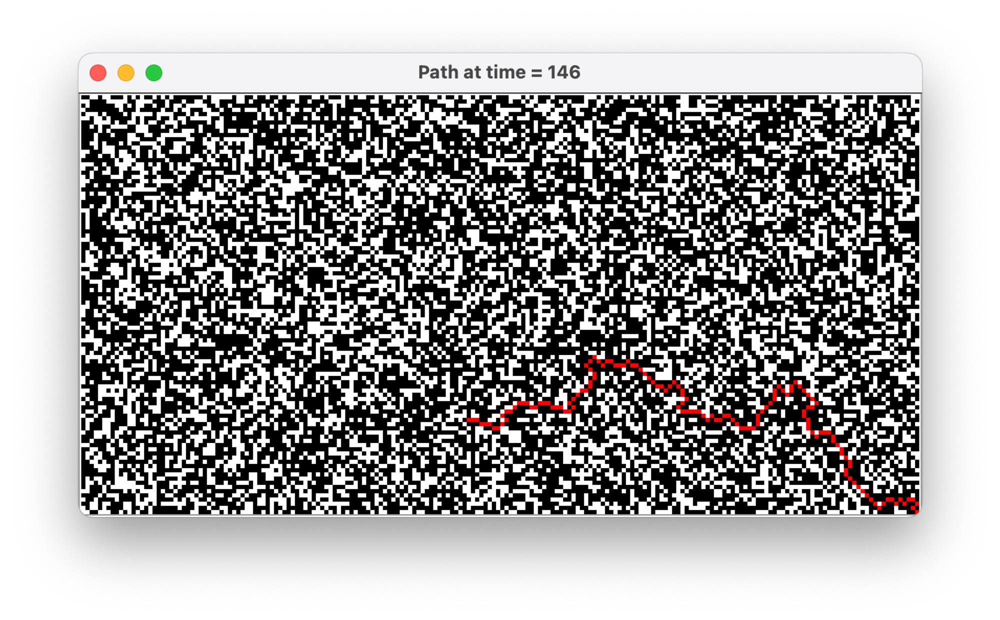

# CS203B spring2023 项目报告

## 1. 项目基本结构

**在 KunKun-ARA 文件夹内：**

| 路径                 | 描述                                                                                     |
| -------------------- | ---------------------------------------------------------------------------------------- |
| Main.java            | 实现程序入口                                                                             |
| AStar.java           | 实现膨胀启发式 A\* 算法                                                                  |
| GameCLI.java         | 实现终端运行                                                                             |
| GameGUI.java         | 实现用户界面运行                                                                         |
| MazePanel.java       | 实现迷宫界面                                                                             |
| MazeGenerator.java   | 随机生成可解输入状态                                                                     |
| Node.java            | 表示迷宫中的节点对象                                                                     |
| TestAStar.java       | 简单地测试 AStar.java                                                                    |
| ARAStar/ARAStar.java | 实现 Anytime Repairing A\* 算法。但由于后续项目要求改动导致弃用，但其功能完整，故保留    |
| ARAStar/MinPQ.java   | algs4.java 中的 MinPQ.java，但将其中的一些 private 方法改为 public 用于实现 ARAStar.java |
| ARAStar/Node.java    | 表示 Anytime Repairing A\* 算法中的节点对象                                              |
| lib/algs4.jar        | 简化输入输出，调用基本的数据结构                                                         |

**实现的功能**

- 程序能够从标准输入 StdIn 中读取初始状态（Requirement 1）
- 程序能在合理的时间内找出问题的解决方案（Requirement 2）
- 程序能在终端（terminal）模式下运行，并以标准输出（StdOut）显示结果（Requiremnet 3）
- 程序能够在 GUI 模式下运行，并显示小妮可和宝藏在迷宫中的位置，且标出被魔法师攻击过的地方（包括可能失效的攻击）（Requirement 4）
- 提供一个按钮，按键按动一下执行一次询问，对当前询问时的路径进行展示（Requirement 5）
- 随机生成可解输入状态（Bonus）

## 2.1 项目的运行方式

### 2.1.1 使用终端

```bash
cd KunKun-ARA/src
javac -cp "../lib/algs4.jar:." *.java
java -cp "../lib/algs4.jar:." Main terminal # 终端模式
java -cp "../lib/algs4.jar:." Main gui # GUI 模式
java -cp "../lib/algs4.jar:." MazeGenerator # 随机生成可解输入状态，参数在**MazeGenerator.java中定义**
```

### 2.1.2 使用 VSCode

导入 KunKun-ARA 文件夹为 Java Project 后，在 `src/Main.java` 中的 `main()` 方法上方点击 run 即可（无参数自动进入 GUI 模式）。

可以在点击 run 运行完一次之后在终端中按上方向键（↑），在 Main 后追加参数 (`terminal` 进入终端模式，`gui` 或者无参数进入 GUI 模式)。

### 2.1.3 使用 IDEA

直接从 Main.java 文件中运行即可。

决定运行终端模式还是 GUI 模式的参数传入在 IDEA 中可以按以下步骤操作：


- 在红色方框内进行命令参数填充。
- 在填充完参数后，点击 Main.java 类，并且对其中的 main()方法进行运行，将迷宫的参数从运行的控制台中进行输入，即可以以对应的方式运行程序。

## 2.2 项目的测试结果

<aside>
💯 与放出的结果完全一致

</aside>

### 2.2.1 Task 1

终端模式输出与`task1_sample_result.txt` 完全一致

**初始界面**


**Time = 15 的路径**


**Time = 10 的路径**


**Time = 6 的路径**


**Time = 5 的迷宫状态**

> 注：在程序新建窗口展示当前问题所对应的路径后，主窗口将自动迭代至下一个时刻（epsilon - 1）。即询问时显示出来的路线图比此时主界面小妮可的位置慢一个时刻，这并不是一个 bug。


**Time = 2 （抵达宝藏）时的迷宫状态**


### 2.2.2 Task 2

终端模式输出与`task2_sample_result.txt` 完全一致

**初始界面**


**Time = 1340 的路径**


**Time = 1313 的路径**


**Time = 1291 的路径**


**Time = 1290 的迷宫状态**


**Time = 1168 （抵达宝藏）时的迷宫状态**


### 2.2.3 Task 3

这是一个由`MazeGenerator.java`生成的随机测试样例

输入见`tests\test3\test3.in`

输出见`tests\test3\test3.out`

**初始界面**


**Time = 12 的路径**


**Time = 11 的迷宫状态**


**Time = 1 （抵达宝藏）时的迷宫状态**


### 2.2.4 Task 4

这是一个由`MazeGenerator.java`生成的随机测试样例

输入见`tests\test4\test4.in`

输出见`tests\test4\test4.out`

**初始界面**


**Time = 492 的路径**


**Time = 146 的路径**



**Time = 145 的迷宫状态**


**Time = 36 的迷宫状态**


**Time = 2 （抵达宝藏）时的迷宫状态**


## 3 项目的思路以及具体实现

由于需要对任意指定时刻显示并计算当前的路径，所以需要一种效率较高（但不需要保证解为最短路径）的寻路算法。

ARA* 算法本身作为一种高效的任意时刻规划算法，很好的符合了此背景的要求。所以我们通过 `ARAStar/Node.java`，`ARAStar/MinPQ.java` 以及 `ARAStar/ARAStar.java` 实现了 ARA* 算法。

但由于后续项目要求改动，需要在每一步都以指定的 $\epsilon$ 进行迭代，这时由于迭代起点每次都发生了变化， ARA* 算法能利用上一次迭代结果对加速下一次路径迭代的优势就消失了，但我们实现的 ARA* 算法功能完整，故仍保留在项目文件中。

由于需要在每一步都以指定的 $\epsilon$ 进行迭代，因此我们每一步都使用膨胀启发式 A\* 算法进行迭代（见`AStar.java`, `Node.java`）。

由于要求程序能在终端模式与 GUI 模式下运行，我们通过 `GameCLI.java` 实现了终端模式的运行逻辑，`GameGUI.java` 实现了 GUI 模式的运行逻辑（迷宫的界面则封装在 `MazePanel.java` 中）。

## 3.1 `GameCLI.java`终端模式实现

### 3.1.1 使用的数据结构

- **`int[][] maze`**：这是一个二维整数数组，表示迷宫的地图。每个元素可能代表迷宫中的不同区域，例如，可能表示墙壁或者通路。
- **`int[][] magic`**：这是另一个二维整数数组，保存一系列的"魔法"动作。当 epsilon 等于 magic 中的某个元素时，`(magic[epsilon][0], magic[epsilon][1])`的状态会被改变。
- **`int[] question`**：这是一个一维数组，当 epsilon 等于 question 中的某个元素时，会打印出当前的路径。
- **`Stack<Node> path`**：这是一个栈，用于保存当前 Nike 规划的行走路径。
- **`Queue<int[]> finalPath`**：这是一个队列，用于保存 Nike 达到终点的完整路径。

### 3.1.2 运行逻辑

1. 初始化：在**`GameCLI`**类的构造函数中，设置 epsilon，迷宫，魔法，问题等数据。
2. **`action()`**方法：在每个 epsilon 值下执行一系列的动作。包括可能的魔法动作（改变迷宫中某个位置的状态），求解当前的最短路径，如果需要打印当前的路径，以及更新 Nike 的位置。
3. **`run()`**方法：在 Nike 到达目标位置之前，循环调用**`action()`**方法，并保存 Nike 的移动路径。

其中**`action()`**方法为核心逻辑，解释如下：

1. **检查并执行"魔法"动作**：如果 **`magic`** 数组非空，并且 **`epsilon`** 的值等于 **`magic[magicIndex][0]`**，那么就在迷宫中的对应位置执行"魔法"动作，即将迷宫中的 **`maze[magic[magicIndex][1]][magic[magicIndex][2]]`** 的值设为 1。然后，如果可能，将 **`magicIndex`** 加一，以便下次执行下一个"魔法"动作。

2. **寻找最短路径**：调用 **`AStar.findPath`** 方法，传入当前迷宫的状态，Nike 的当前位置，目标位置，当前的 **`epsilon`** 值，以及 **`path`** 栈来保存找到的最短路径。

3. **检查并打印当前路径**：如果 **`question`** 数组非空，并且 **`epsilon`** 的值等于 **`question[questionIndex]`**，那么就打印当前的路径。然后，如果可能，将 **`questionIndex`** 加一，以便下次在适当的时候打印下一个路径。

4. **更新 Nike 的位置**：如果 **`path`** 栈非空，那么就从栈中取出（并移除）两个节点。第一个节点是 Nike 的当前位置，因此直接弹出并丢弃。第二个节点则是 Nike 的下一步位置，将这个位置的行和列分别赋值给 **`nikeRow`** 和 **`nikeCol`**。然后，如果 **`epsilon`** 大于 1，将 **`epsilon`** 减一。

## 3.2 `GameGUI.java`GUI 模式实现

### 3.2.1 使用的数据结构

与终端模式的实现一致。

### 3.2.2 运行逻辑

1. **初始化**：在**`GameGUI`**类的构造函数中，它首先设置了游戏所需的参数和数据，然后创建了一些必要的 GUI 组件，如窗口(frame)，按钮(button)，以及迷宫的显示面板(mazePanel)。

2. **`buttonPressed()`方法**：这是按钮的事件监听器所调用的方法。当点击按钮时，它将检查是否还有剩余的问题(question)需要处理，如果有，则会调用**`action()`**方法执行动作，直到到达下一个问题或到达目标。

3. **`action()`方法**：这个方法和**`GameCLI`**中的**`action()`**类似，但是在执行动作的同时，它还会更新 GUI 的状态，例如，如果执行了"魔法"动作，就会改变迷宫中对应单元格的颜色；如果需要打印路径，就会弹出一个新的窗口显示路径；每移动一步，就会更新 Nike 在迷宫面板上的位置，以及在标签中显示的 epsilon 值。

4. **`run()`方法**：这个方法将使主窗口变得可见，从而启动 GUI。

5. **`showPath()`方法**：这个方法会在新窗口中显示当前的路径。这是通过创建一个新的迷宫面板，并将路径上的每个单元格的颜色设为红色来实现的。

### 3.2.3 `MazePanel.java`迷宫界面的颜色定义

| 颜色          | 定义            |
| ------------- | --------------- |
| Color.WHITE   | 可通行          |
| Color.BLACK   | 不可通行        |
| Color.ORANGE  | Nike 的位置     |
| Color.MAGENTA | 有效的魔法位置  |
| Color.PINK    | 无效的魔法位置  |
| Color.RED     | Nike 规划的路径 |
| Color.GREEN   | 宝藏的位置      |

## 3.3 `AStar.java`膨胀启发式 A\* 算法实现

_ARA: Anytime A_ with Provable Bounds on Sub-Optimality\* 中给出的伪代码：


### 3.3.1 具体实现

```java
public static boolean findPath(int[][] maze, int[] start, int[] goal, double epsilon, Stack<Node> path) {
    Node[][] visited = new Node[maze.length][maze[0].length];

    double sh = heuristic(start, goal);
    double sf = epsilon * sh;
    Node startNode = new Node(start[0], start[1], 0, sh, sf, null);
    MinPQ<Node> openSet = new MinPQ<>();
    openSet.insert(startNode);

    while (!openSet.isEmpty()) {
        Node current = openSet.delMin();

        if (current.row == goal[0] && current.col == goal[1]) {
            while (!path.isEmpty()) {
                path.pop();
            }
            while (current != null) {
                path.push(current);
                current = current.parent;
            }
            return true; // Path found
        }

        for (int[] direction : DIRECTIONS) {
            int newRow = current.row + direction[0];
            int newCol = current.col + direction[1];

            boolean isInBounds = newRow >= 0 && newRow < maze.length && newCol >= 0 && newCol < maze[0].length;
            if (!isInBounds || maze[newRow][newCol] == 1) {
                continue;
            }

            Node neighbor = visited[newRow][newCol];
            if (neighbor == null) {
                neighbor = new Node(newRow, newCol,
                        Double.POSITIVE_INFINITY, heuristic(new int[] { newRow, newCol }, goal),
                        Double.POSITIVE_INFINITY, current);
                visited[newRow][newCol] = neighbor;
            }
            if (neighbor.g > current.g + 1) {
                neighbor.g = current.g + 1;
                neighbor.f = neighbor.g + epsilon * neighbor.h;
                openSet.insert(neighbor);
            }
        }
    }

    return false; // No path found
}
```

`findPath`函数是`AStar.java` 中的主要方法，与论文中给出的伪代码基本一致。它用于在二维迷宫中寻找从起始点到目标点的最优路径。这个函数使用了启发式膨胀的 A\*算法，该算法的目标是尽可能快速地找到一条路径，而不一定是最短路径。

让我们详细地分析一下这个函数：

1. 函数定义：`public static boolean findPath(int[][] maze, int[] start, int[] goal, double epsilon, Stack<Node> path)`，该函数接收五个参数：一个迷宫地图，起始点和目标点的坐标，一个 epsilon 参数用于启发式膨胀，以及一个用于存储找到路径的堆栈。
2. 初始化：首先，函数初始化一个`visited`二维数组，用来存储迷宫中每个位置的节点信息。然后，计算起始点的启发式成本并创建起始节点，将其插入到优先级队列`openSet`中。
3. 主循环：主循环持续进行，直到`openSet`为空（无法找到路径）或找到目标节点为止。在每次循环中，它会从`openSet`中删除具有最小 f 值的节点（当前节点）。
   - 如果当前节点是目标节点，函数会将从起始节点到目标节点的路径推入到`path`堆栈中，并返回`true`。
   - 如果当前节点不是目标节点，函数会检查当前节点的每个邻居。如果邻居在迷宫内且不是障碍物，它会检查这个邻居是否被访问过（是否在`visited`数组中）。如果邻居没有被访问过，它会创建一个新的节点并将其添加到`visited`数组中。如果邻居的 g 值（从起始点到这个邻居节点的实际成本）大于当前节点的 g 值加上从当前节点到这个邻居节点的距离，那么函数会更新邻居的 g 值和 f 值（g 值加上启发式成本），然后将邻居插入到`openSet`中。
4. 如果函数退出主循环并且没有找到路径，它会返回`false`。

这个函数的关键点在于启发式函数的膨胀，即 f 值的计算：`neighbor.f = neighbor.g + epsilon * neighbor.h;`。epsilon 参数可以控制膨胀的程度，如果 epsilon 等于 1，那么这就是标准的 A\*算法；如果 epsilon 大于 1，那么搜索会倾向于那些离目标点近的节点，可能会更快地找到路径，但这个路径可能不是最短的。

## 3.4 `MazeGenerator.java` 随机生成可解输入状态实现

参数在**MazeGenerator.java 中定义**

### 3.4.1 这个类主要的参数以及函数：

**主要参数：**

> 这些值需要用户在`MazeGenerator.java` 中自行定义，未实现终端输入。

- 行数（`ROWS`）
- 列数（`COLS`）
- 打通格子的概率（`P`）
- 魔法的个数（`MAGIC_LENGTH`），如果非法可能会被改写为合适的值
- 问题的个数（`QUESTION_LENGTH`），如果非法可能会被改写为合适的值
- 初始 `epsilon` 的值，如果可能导致无解会被改写为合适的值

**主要函数：**

1. `main`：这是程序的入口点。它首先生成迷宫，检查生成的迷宫是否存在路径，如果不存在路径，则重新生成迷宫。然后在迷宫中放置魔法，并确保在给定的`epsilon`值下，可以找到的路径长度小于`epsilon` （即保证有足够的时间走完迷宫）。最后，它打印出迷宫和魔法的信息，并生成问题。
2. `generateMaze`：这个函数用于生成迷宫。它接收迷宫的行数、列数和打通格子的概率作为参数。然后，它创建一个新的迷宫，打通入口和出口，按照给定的概率随机打通其他格子。
3. `isPath`：这个函数用于检查迷宫是否存在从起始点到目标点的路径。它使用膨胀启发式 A\* 算法实现进行搜索，如果找到路径，返回路径长度；否则，返回 0。
4. `placeSomeMagic`：这个函数用于在迷宫中随机放置一定数量的魔法。对于每个魔法，它随机选择一个位置，如果这个位置是障碍物，就打通这个格子并在准备这里放置魔法；否则，再次选择一个位置。

### 3.4.2 深入解释`main`函数：

1. 在`main`函数中，首先定义了迷宫的参数：行数（ROWS）、列数（COLS）、打通格子的概率（P）、魔法的个数（MAGIC_LENGTH）、问题的个数（QUESTION_LENGTH）和 epsilon 的值。
2. 接着，函数会生成迷宫（使用 `generateMaze` 函数）并检查是否存在从起始点到目标点的路径（使用 `isPath` 函数）。如果不存在路径，它会重新生成迷宫，直到生成的迷宫存在路径。
3. 然后，在迷宫中放置魔法（使用 `placeSomeMagic` 函数）。在这一步，魔法会被随机地放置在迷宫的不同位置。放置魔法的步骤是随机找到迷宫中的障碍物，将其打通并记录将在这个位置放置魔法。由于步骤 2 中以经确保了迷宫有解，故这样防放置魔法后依然能保持有解。
4. 然后有一个循环，该循环不断检查路径长度（也就是需要的步数）是否小于 epsilon。如果路径长度大于或等于 epsilon，那么就将 epsilon 增大为路径长度加 1，并重新计算路径长度。这个循环的目的是保证在 epsilon 的时间内，膨胀启发式 A\* 算法能够找到一条到达目标的路径（到达目标时 epsilon ≥ 1）。
5. 接下来，函数将打印迷宫的信息，包括行数、列数和 epsilon 的值。然后，它会按行打印迷宫，其中每个格子的值后面都有一个空格。
6. 然后，函数会打印魔法的个数，并生成放置魔法的时间序列。魔法的时间序列是一些随机生成的、不重复的、小于路径长度的数。这些数表示在哪个时间点出现魔法。魔法的时间序列会被降序排序，并打印出来。
7. 最后，函数会打印问题的个数，并生成问题的时间序列。问题的时间序列的生成方式与魔法的时间序列类似，也是生成一些随机的、不重复的、小于路径长度的数。这些数表示在哪个时间点出现问题。问题的时间序列也会被降序排序，并打印出来。

## 3.5 `ARAStar.java`Anytime Repairing A\* 算法实现

在本次 project 中，我们最初希望实现的算法是 Anytime Repairing A* 算法，而 ARA* 算法解决的最根本的问题就是保证在任意时刻都有抵达目标的道路。这是通过在开始选择较大的膨胀因子，使得计算量减少，可以在初始状态下以较短的时间生成一条道路实现的。并且 ARA* 算法在剩余的允许时间之内不断减小 epsilon 对路径进行反复迭代得到更优路径。此外 ARA* 算法还能利用上一次的迭代结果加速下一次路径的迭代。

但由于项目要求中没有明显提到对于限定计算路径时间的说明（在后续的更新中也没有），这使得 ARA* 算法每次都是计算到 epsilon’ = 1 的情况，也就是说一直再用一种递归的方法慢慢地向 A* 算法进行靠近，所以整体而言并没有把这个算法的任意时刻性体现出来，故我们实在不理解一开始在项目要求中提到 ARA* 算法的目的。因此我们最后只能按照项目要求在每一步使用膨胀启发式 A* 算法重新迭代路径。

但由于我们在项目初期已经实现了 ARA\* 算法，因此还是希望在这次报告中进行展示。

我们通过 `ARAStar/Node.java`，`ARAStar/MinPQ.java` 以及 `ARAStar/ARAStar.java` 实现了 ARA\* 算法。

### 3.5.1 ARA\*算法实现的思路与考量

对于 ARA*算法本身的优势分析已经在论文《ARA*: Anytime A\* with Provable Bounds on Sub-Optimality》中阐述的相当清晰，这里不再赘述。这是原论文的中的 Pseudocode：


- fvalue()方法简单地返回 f 函数的值，这很 trivial。
- 在 ImprovePath()方法中，我们需要找到 OPEN 这个容器中的拥有最小 f 值的节点 s 并且把节点进行删除，我们可以知道，对于 algs4.jar 中提供的最小优先队列 MinPQ.java 类能够非常方便地实现我们的想法，但是我们同时发现在右侧的主方法 Main()中，我们同时需要返回 OPEN 容器与 INCONS 容器中最小的（g + h）的值以更新用于膨胀计算的 epsilon’。介于对于膨胀式 A*算法本身的优势，我们知道开始的时候 epsilon 的值是远大于 1 的，这也就是说，fvalue(s) = g(s) + epsilon* h(s）此整体与 g(s) + h(s）两者的值存在区别，但是需要同时对于 OPEN 容器中的所有节点确定以两个不同键所决定的序关系，显然 MinPQ 是无法同时维持两种序关系的，所以，鉴于 INCONS 集合也需要对 g(s) + h(s）的最小值进行搜索，并且认为在对 epsilon’ 进行更新时对算法优化的影响大于在 improvePath() 方法调用速度的影响，以及寻找两者分别最小值的方法在不用优先队列的前提下，都几乎只能通过线性搜索来完成，我们将 compareTo 方法比较的具体值设置成了 g(s) + h(s)，并且对于另一种序关系 fvalue(s) 的寻找采用了线性遍历搜索法（对于链表而言，并没有更优的策略）。
- 鉴于上述的分析，以及需要对于使得 fvalue(s) 值最小的节点 s 在 OPEN 此优先队列中进行删除，但是却不能直接调用 MinPQ 里现有的删除方法（事实上 MinPQ 里只有 delMin()方法用于删除键值最小的元素，但是定义的键值是以 g(s) + h(s) 的大小有序的），所以，想到了在找到了节点 s 之后，将 s 的 g 值与 h 值设置为负无穷，然后使用本身维护优先队列的 swim() 方法来将此节点 s 上浮使得整棵树仍然最小优先队列，最终再通过 delMin()方法即可以将现在 g + h 值达到最小的节点 s 进行删除，并且保证整棵树在进行了这一系列操作之后仍然为一个最小优先队列。但是由于 swim()方法是 algs4.MinPQ.java 类中的私有 private 方法，所以将 algs4 中的 MinPQ.java 文件的需要部分进行了复制建立一个新的类 MinPQ.java，并且将其中的 swim() 方法改为了 public，以方便接下来的调用与维护。

### 3.5.2 具体代码实现的部分解释

- 首先使用了 Node 这个节点作为一个类，大致内容如下，存储了行列信息，与和 ARA*算法相对应的既有成本函数 g、以及启发式函数 h 的数值记录。并且实现了 Comparable 接口，并且以（g + h)的值作为其具体比较的键值（以便接下来对于 MinPQ<Node>的实现），而 parent 指针的实现是为了在 ARA*算法达到终止条件时，对形成最佳路径的结点进行回溯。
  ```java
  public class Node implements Comparable<Node> {
      int row;
      int col;
      double g;
      double h;
      Node parent;
  
      @Override
      public int compareTo(Node other) {
          return Double.compare(this.g + this.h, other.g + other.h);
      }
  }
  ```
- 其次，按照上述分析，对于 MinPQ.java 的修改如下：
  1. 将 swim 方法由 private 转化成 public。
  2. 实现方法 index(Key key)，返回某个指定元素的序号，这是因为在调用 swim() 方法时，需要对序号作为参数传入方法才能进行调用。特别的，这边是在此数组的末尾向前寻找，一旦找到元素就进行 return。这是为了防止当某个具体的 MinPQ 类的对象 OPEN 需要找到指定元素进行删除时，由于 OPEN 中的元素是可以重复的，所以单纯的从前往后寻找可能会使得所希望删除的键值的数与其 index() 方法的返回值不匹配，从而造成误删和错删而导致最小队列没有得到充分维护，所以统一从末尾寻找第一个相等的元素能够解决这个问题。
  ```java
  public void swim(int k) { //modify the accessor "private" to "public".
      while (k > 1 && greater(k/2, k)) {
          exch(k/2, k);
          k = k/2;
      }
  }
  
  //other code
  
  public int index(Key key){
      for (int i = n; i >=1; i--) {
          if (pq[i].equals(key)){
              return i;
          }
      }
      return 0; //return the index of key in pq[].
  }
  ```
- 最后，在建立好了这些基础之后，我们可以开始 ARAStar.java 的设计，具体代码将分段展示并解释，整体与参考论文中提供的 Pseudocode 的逻辑几乎一致：
  ```java
  public class ARAStar {
      private int[][] maze;
      private Node goal;
      private static final int[][] DIRECTIONS = { { -1, 0 }, { 1, 0 }, { 0, -1 }, { 0, 1 }, { -1, -1 }, { -1, 1 },{ 1, -1 }, { 1, 1 } };
      private MinPQ<Node> OPEN = new MinPQ<>();
      private ArrayList<Node> CLOSED = new ArrayList<>();
      private MinPQ<Node> INCONS = new MinPQ<>();
      private int height;
      private int width;
      private double epsilon;
      private double epsilonPrime;
      private final double minEpsilon = 1.0;
      public Node[][] accessed;
      private Stack<Node> path;
  }
  ```
- 上述是代码的变量声明部分：
  1. 其中 OPEN 和 INCONS 都是 MinPQ<Node>类的对象，而由于集合 CLOSED 不需要对于其中元素进行顺序查找，所以简单设成一个 ArrayList。
  2. 此时传入的迷宫以数组 maze 进行保存，以 height 与 width 分别记录这个 maze 的行数和列数，并且将终点节点 goal 进行单独声明，由于需要上、下、左、右、左上、左下、右上、右下八个搜索方向，所以将这八个方向以数组（向量）形式保存在二位数组 DIRECTIONS 中。
  3. 由于膨胀式 ARA\*算法中需要 epsilon 并每次递减 1 来控制整体膨胀银子的递减趋势，保证过程终止，与真实的膨胀因子 epsilonPrime = min( epsilon , g(goal) /{min (g(s) + h(s) ) for s belongs to OPEN union INCONS})，故对两者进行全局声明。由于膨胀因子总是大于 1，所以设置终止下界 minEpsilon = 1.0。
  4. 在对 ARA\*算法寻找出来的路径进行寻找时，需要将此路径上的节点进行记录，而最合适的一类记录方式即为栈的结构 Stack<Node>，这是因为寻找路径时，是从终点进行回溯的，所以栈的后进先出的反序结构，恰好能满足对于路径的输出要求。
  5. 二维数组 Node[][] accessed 是用于判断当前 Node 是否已经被访问过，因为 ARA\*算法中的循环中，节点是否是第一次访问对于其 g 值的更新很重要，所以通过这个数组对于是否访问进行记录。
  ```java
  public static double heuristic(int[] a, int[] b) {
      return Math.sqrt(Math.pow(a[0] - b[0], 2) + Math.pow(a[1] - b[1], 2));
  }
  
  private double fValue(Node s) {
      return s.g + epsilonPrime * s.h;
  }
  ```
- 上述代码是本 ARA\*算法中的启发式函数，虽然启发式函数可以选择各种合理的距离，但是由于本次作业要求中上、下、左、右、左上、左下、右上、右下八个行走方向都是合理的，并且都只花费一个步数，所以需要将斜着走一格与横着加竖着各走一格两者进行期望代价区分，如果单纯选择曼哈顿直角距离，那么就会将两者等同从而会更难以得出最佳路径，所以在本题中，采用了二维欧式距离的计算。
  在这种情况下，斜着走一格的期望代价是根号 2 = 1.414…，横着加竖着各走一格的期望是 2，所以实现了斜着走为更优选择的判断。至于 fValue()，这很 trivial。
  ```java
  private Node findMinF(MinPQ<Node> open, double fGoal) {
      if (!open.isEmpty()) {
          Node node = open.min();
          for (Node node1 : open) {
              if (fValue(node1) < fValue(node)) {
                  node = node1;
              }
          }
          double min = fValue(node);
          Node minNode = new Node(node);
          if (fGoal > min) {
              int index = open.index(node);
              node.g = Double.NEGATIVE_INFINITY;
              node.h = Double.NEGATIVE_INFINITY;
              open.swim(index);
              open.delMin();
              node.g = minNode.g;
              node.h = minNode.h;
              return minNode;
          } else
              return null;
      } else
          return null;
  }
  ```
- 由于要实现对于 OPEN 集合中使得 fValue(s) 最小的节点 s 进行删除，这里采用方法 findMinF() 方法对此进行实现。首先利用线性遍历找到使得 fValue 值最小的节点并记作 node，并且将其值 fValue(node) 记录为 min，对于 ARA*算法中的要求进行判断：也即当 fGoal > fValue(node) 时，需要将 node 在 OPEN 中移除，如 Part2_1 中的分析与解释，首先找到 node 在数组中的最后一个 index，然后将其的 g 和 h 值都赋值为 Double.NEGATIVE_INFINITY，使得其 g + h 值一定在整个 OPEN 中最小，利用 swim(index)方法将 OPEN 仍然维护成最小优先队列并且让 node 处于最小的位置，再利用 delMin() 方法将 node 在 OPEN 中进行删除，并且再将原本 node 的 g 与 h 的值进行还原。在此之前，利用 minNode 将此即将被删除的 node 进行记录并作为方法的返回值，从而实现了如同 ARA*算法中所要求的逻辑顺序，并且返回了最小节点。
  ```java
  public void improvePath(int[][] maze, Node goal, Stack<Node> path) {
      Node s;
      while ((!OPEN.isEmpty()) && ((s = findMinF(OPEN, fValue(goal))) != null)) {
          CLOSED.add(s);
  
          if (s.row == height - 1 && s.col == width - 1) {
              goal.g = s.g;
              while (!path.isEmpty()) {
                  path.pop();
              }
              while (s != null) {
                  path.push(s);
                  s = s.parent;
              }
              return; // Return the current epsilon value
          }
  
          for (int[] direction : DIRECTIONS) {
              int newRow = s.row + direction[0];
              int newCol = s.col + direction[1];
              if (newRow >= 0 && newRow < height && newCol >= 0 && newCol < width && maze[newRow][newCol] == 0) {
                  if (accessed[newRow][newCol] == null) {
                      accessed[newRow][newCol] = new Node(newRow, newCol, Double.POSITIVE_INFINITY,
                              heuristic(new int[] { newRow, newCol }, new int[] { height - 1, width - 1 }), s);
                  }
                  Node t = accessed[newRow][newCol];
                  if (t.parent != null && t.parent.g > s.g)
                      t.parent = s;
                  if (t.g > s.g + heuristic(new int[] { s.row, s.col }, new int[] { t.row, t.col })) {
                      t.g = s.g + heuristic(new int[] { s.row, s.col }, new int[] { t.row, t.col });
                      if (!CLOSED.contains(t) && OPEN.index(t) == 0) {
                          OPEN.insert(t);
                      } else
                          INCONS.insert(t);
                  }
              }
          }
      }
  }
  ```
- 在执行完了返回并在 OPEN 中移除最小节点的操作后，进入 while 循环，将此元素 s 加入 CLOSED 链表中，并开始进行判断，如果此时 s 已经是终点节点，那么可以通过 s 的 parent 指针进行最优路径的回溯，并且终止算法。如果尚未到达终点，则对其合法的邻接节点进行搜索，如果时先前尚未访问过的节点（即其所对应的 accessed[newRow][newcol] == null 时），则对其进行初始化并且将其 g 值设置为正无穷；如果已经访问过，那么根据其先前的 g 值与作为节点 s 的次结点所产生的 g 值进行比较，并且更新成较小者，同时也将其原有父节点改为当前的节点 s ，并且对其是否在 CLOSED 中进行判断，如果不在，则加入 OPEN（代码实现了防止重复加入），否则则加入局部不一致集合 INCONS。重复此过程，即完成了 improvePath()。

```java
public double findMinSum() {
    if (!OPEN.isEmpty() && !INCONS.isEmpty()) {
        return Math.min(OPEN.min().g + OPEN.min().h, INCONS.min().g + INCONS.min().h);
    } else if (!OPEN.isEmpty()) {
        return OPEN.min().g + OPEN.min().h;
    } else if (!INCONS.isEmpty()) {
        return INCONS.min().g + INCONS.min().h;
    } else
        return 0.01;
}
```

- 利用 findMinSum() 方法实现对于 min (g(s) + h(s) ) for s belongs to OPEN union INCONS)数值的查找，具体的思路即为分别找到 OPEN 和 INCONS 中的 g(s) + h(s) 的最小值（因为两者都是以 g(s) + h(s) 为键值的优先队列，这非常容易），并且对此两者的最小值取最小即可。因为真实的膨胀因子 epsilonPrime = min( epsilon , g(goal) /{min (g(s) + h(s) ) for s belongs to OPEN union INCONS})，所以当 OPEN 和 INCONS 都为空集时，不应该对 epsilonPrime 提供有意义的减小信息，所以分母的值设的足够小（在此处认为 0.01 已经足够小），对问题的更新没有影响，从而完成了 findMinSum() 方法。

```java
private void firstIterate(Node start) {
    OPEN.insert(start);
    improvePath(maze, goal, path);
    epsilonPrime = Math.min(epsilon, goal.g / findMinSum());
}

private void otherIterate() {
    epsilon -= 1;
    while (!INCONS.isEmpty())
        OPEN.insert(INCONS.delMin());
    CLOSED.clear();
    improvePath(maze, goal, path);
    epsilonPrime = Math.min(epsilon, goal.g / findMinSum());
}

public Stack<Node> iterate(Node start) {
    firstIterate(start);
    while (epsilonPrime > minEpsilon) {
        otherIterate();
    }
    return path;
}
```

- iterate 方法相当于原论文 Pseudocode 中的 Main() 方法中所实现的内容几乎一致（返回值即为当前的 ARA\*算法给出的路径），几乎没有多余实现细节需要处理，在此不加赘述。
- 综上所述，我们成功利用 Pseudocode 在 java 语言中实现了 ARA\*算法。

## 4. 一些感悟

- 在本次项目中，我们意识到对算法的学习和理解能力的重要性。实现 ARA\*方法并将其应用于路径搜索需要深入了解算法背景，并将其与实际问题相结合。从算法中抽象出思路，并总结出实际可行的算法步骤，这对我们的思维能力提出了较高的要求。
- 我们在本次项目中提升了对数据结构的理解和运用水平。项目中使用了最小优先队列、栈、列表等多种数据结构来实现算法的各个功能。这要求我们对这些数据结构有一定的掌握，并能够合理地运用它们来解决问题。
- 项目中我们学会了区分 GUI 和终端的实现方式，并意识到它们各自的特点和应用场景。这让我们在将来能够根据需要选择适当的实现方式。
- 在项目中，我们努力提高了代码的可读性和可维护性，注重代码架构的管理。这对于项目的顺利进行非常重要，也使我们更加注重编写整洁、易懂的代码。